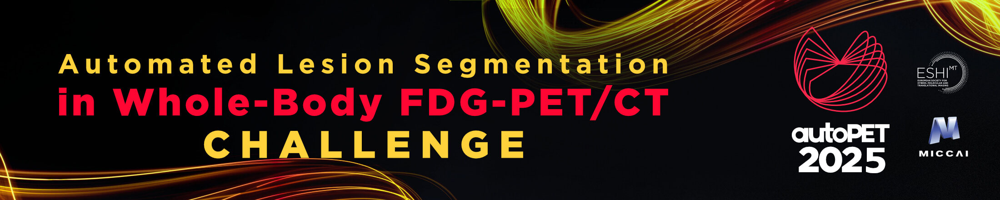

# autoPET/CT IV challenge --Task1
Repository for code associated with autoPETIV machine learning challenge: <br/> 
[autopet-iv.grand-challenge.org](https://autopet-iv.grand-challenge.org/autopet-iv/) 

If you use the data associated to this challenge, please cite: <br/>
<a href="https://doi.org/10.7937/gkr0-xv29"></a> <a href="https://doi.org/10.7937/r7ep-3x37"></a> 

```
Gatidis S, Kuestner T. A whole-body FDG-PET/CT dataset with manually annotated tumor lesions (FDG-PET-CT-Lesions) 
[Dataset]. The Cancer Imaging Archive, 2022. DOI: 10.7937/gkr0-xv29
```

and
<br/>

```
Jeblick, K., et al. A whole-body PSMA-PET/CT dataset with manually annotated tumor lesions 
(PSMA-PET-CT-Lesions) (Version 1) [Dataset]. The Cancer Imaging Archive, 2024.
DOI: 10.7937/r7ep-3x37
```

# Task 1: Single-staging whole-body PET/CT

## interactive-baseline
Baseline model 1 for lesion segmentation: The SW-FastEdit model (https://github.com/Zrrr1997/SW-FastEdit) was used for training the baseline. 
The model input channels were structured as follows:
* FDG-PET (SUV) volumes from the autoPET II challenge, 
* Simulated JSON files generated for each image where each `.json` file contains 10 tumor and 10 background clicks with `(x, y, z)` coordinates (example below):
```
{"tumor": [[109, 103, 353], [99, 92, 178], [69, 98, 133], [120, 70, 360], [90, 104, 340], [71, 96, 344], [93, 70, 284], [100, 64, 312], [110, 96, 375], [93, 80, 187]], "background": [[84, 84, 264], [100, 116, 253], [80, 96, 277], [93, 87, 200], [71, 98, 263], [143, 99, 351], [68, 94, 272], [85, 90, 272], [104, 99, 388], [103, 110, 272]]}
```
    - "tumor": represent lesions (foreground) clicks
    - "background": represents background clicks
For each corresponding image, 3D Gaussian heatmaps were generated for both the foreground (tumor) and background clicks. These heatmaps were then converted to NIfTI format.
The model  was trained using three input channels.

## nnunet-baseline
Baseline model 2 for lesion segmentation: The nnUNet framework (https://github.com/MIC-DKFZ/nnUNet) 
was used for training the baseline model using the 3D fullres configuration with 32 GB of VRAM. 
The model input channels were structured as follows:
* PET (SUV) volumes from autoPET III challenge (FDG & PSMA)
* Resampled CT volumes from autoPET III challenge (FDG & PSMA)
* 3D Gaussian heatmap for both the foreground clicks
* 3D Gaussian heatmap for both the background clicks
The model was trained using four input channels over 250k steps; the initial learning rate to 1e-4. Training was performed with 
1 sample (fold 0). Inference runs without test-time augmentation because of the challenge time limit of 5 minutes.


## evaluation-metrics
Evaluation code for the autoPET/CT IV challenge according to [here](https://autopet-iv.grand-challenge.org/evaluation-and-ranking/)

## References
Challenge: [](https://doi.org/10.5281/zenodo.10990932)<br/>
FDG Database: <a href="https://doi.org/10.7937/gkr0-xv29"></a> <br/>
PSMA Database: <a href="https://doi.org/10.7937/r7ep-3x37"></a> 


